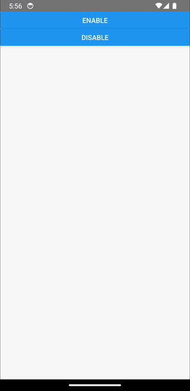

<h1 align="center">
  react-native-kiosk
</h1>

<h4 align="center">Enable Kiosk Mode with a single line of code</h4>

<p align="center">
  <a href="https://badge.fury.io/js/@genesisxyz%2Freact-native-kiosk.svg">
    
  </a>
  <a href="https://www.paypal.me/genesisxyz">
    
  </a>
</p>

<p align="center">
  <a href="#key-features">Key Features</a> •
  <a href="#installation">How To Use</a> •
  <a href="#how-to-use">How To Use</a> •
  <a href="#contributing">Contributing</a> •
  <a href="#license">License</a>
</p>

<div align="center">
  
</div>

## Key Features

- Toggle Kiosk Mode with single line of code

## Installation

```sh
npm install @genesisxyz/react-native-kiosk
```

## How To Use

### Android

To enable admin you need to run:

```bash
adb shell dpm set-device-owner com.kioskexample/com.kiosk.MyDeviceAdminReceiver
```

To remove admin instead do:

```bash
adb shell dpm remove-active-admin com.kioskexample/com.kiosk.MyDeviceAdminReceiver
```

To kill the app you can use:

```bash
adb shell ps | grep packageinstaller | awk '{print $2}' | xargs adb shell kill
```

Change `com.kioskexample` to your bundle id

If you want the app to be able to run automatically as default you need to add to your `AndroidManifest.xml` inside `<intent-filter>`:

```xml
<action android:name="android.intent.action.MAIN" />
<category android:name="android.intent.category.LAUNCHER" />
<!-- add these next 2 lines -->
<category android:name="android.intent.category.DEFAULT" />
<category android:name="android.intent.category.HOME" />
```

Also, on `<Application>` add:

```xml
android:testOnly="true"
```

Remember to remove this line for release

Android only: if you want a custom admin receiver you need to add the receiver as (`MyDeviceAdminReceiver.kt`):

```kt
package com.kiosk

import android.app.admin.DeviceAdminReceiver
import android.content.ComponentName
import android.content.Context

class MyDeviceAdminReceiver : DeviceAdminReceiver() {
  companion object {
    fun getComponentName(context: Context): ComponentName {
      return ComponentName(context.applicationContext, MyDeviceAdminReceiver::class.java)
    }
  }
}
```

Inside `res/xml` you need to create `device_admin_receiver.xml` with this content:

```xml
<?xml version="1.0" encoding="utf-8"?>
<device-admin>
  <uses-policies>
    <limit-password />
    <watch-login />
    <reset-password />
    <force-lock />
    <wipe-data />
    <expire-password />
    <encrypted-storage />
    <disable-camera />
    <disable-keyguard-features />
  </uses-policies>
</device-admin>
```

And you need to referene the file inside the `AndroidManifest.xml`:

```xml
<application>
    <!-- add this receiver inside application -->
    <receiver
      android:name=".MyDeviceAdminReceiver"
      android:description="@string/app_name"
      android:label="@string/app_name"
      android:permission="android.permission.BIND_DEVICE_ADMIN"
      android:exported="true">
      <meta-data
        android:name="android.app.device_admin"
        android:resource="@xml/device_admin_receiver" />
      <intent-filter>
        <action android:name="android.app.action.DEVICE_ADMIN_ENABLED"/>
      </intent-filter>
    </receiver>
  </application>
```

You need to init the module with the full path of your custom admin receiver:

```js
import Kiosk from 'react-native-kiosk';

Kiosk.init({
  android: {
    customAdminReceiver: 'com.kioskexample.MyDeviceAdminReceiver',
  },
});
```

Change `com.kioskexample` to your bundle id

```js
import Kiosk from 'react-native-kiosk';

// ...

await Kiosk.enable();
```

## Contributing

See the [contributing guide](CONTRIBUTING.md) to learn how to contribute to the repository and the development workflow.

## License

MIT

---

> [genesisxyz.dev](https://www.genesisxyz.dev) &nbsp;&middot;&nbsp;
> GitHub [@genesisxyz](https://github.com/genesisxyz) &nbsp;&middot;&nbsp;
> Twitter [@thedummyxyz](https://twitter.com/thedummyxyz)
